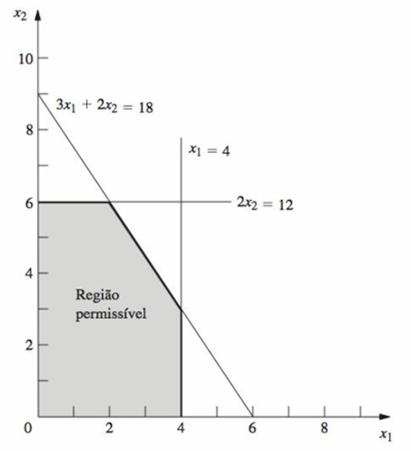

**Problema de Alocação de Recursos**

Aprofundando a compreensão do problema:

O livro Introdução à Pesquisa Operacional, indicado na bibliografia, apresenta a solução gráfica para um problema desse tipo, da seguinte forma:

O problema contém as seguintes equações:

$max Z = 3 x_1 + 5 x_2$

$x_1 \le 4$

$2x_2 \le 12$

$3x_1 + 2x_2 \le 18$

$x_1 \ge 0$

$x_2 \ge 0$

A solução gráfica é indicada pelo área sombreada da seguinte imagem:

Essa é o chamado conjunto de valores viáveis ou a chamada região de soluções viáveis.

Para criar a imagem correspondente para o nosso problema, o programa solucao_grafica.py faz a plotagem equivalente para as nossas equações e está disponível no seguinte [notebook do colab](https://colab.research.google.com/drive/1MbcLXCKaOfEIxdnHXV_3lLVQJul9sd7L?usp=sharing)

1. Modelagem Matemática (Formulação Padrão)

Para resolver o problema usando ferramentas computacionais, primeiro traduzimos o enunciado para a forma canônica de um Problema de Programação Linear (PPL).

Variáveis de Decisão:

$x_1$: Quantidade de Instâncias "Deep Learning" (DL).

$x_2$: Quantidade de Instâncias "Data Analytics" (DA).

Função Objetivo (Maximizar Lucro):$$\max Z = 50x_1 + 30x_2$$

Restrições (Sujeito a):

Processamento: $2x_1 + 1x_2 \le 100$

Memória RAM: $1x_1 + 2x_2 \le 120$

Demanda Mínima DL: $x_1 \ge 10$

Demanda Mínima DA: $x_2 \ge 10$

Não-negatividade: $x_1, x_2 \ge 0$ (implícita pela demanda mínima).

2. Implementação em Python (scipy.optimize)

Para implementarmos uma solução para o problema, podemos utilizar a biblioteca `scipy.optimize.linprog`. Essa biblioteca trabalha, por padrão, com minimização. Como nosso objetivo é o de maximizar, devemos multiplicar os coeficientes da função objetivo por -1.

    import numpy as np
    from scipy.optimize import linprog

    # Coeficientes da Função Objetivo (Negativos para Maximizar)
    # f = - (50*x1 + 30*x2)
    c = [-50, -30]

    # Matriz de Restrições de Desigualdade (Lado Esquerdo: A_ub)
    # 2*x1 + 1*x2 <= 100
    # 1*x1 + 2*x2 <= 120
    A = [
        [2, 1], 
        [1, 2]
    ]

    # Vetor de Restrições de Desigualdade (Lado Direito: b_ub)
    b = [100, 120]

    # Limites das Variáveis (Bounds)
    # x1 >= 10 e x2 >= 10
    x1_bounds = (10, None) # None significa sem limite superior
    x2_bounds = (10, None)

    # Executando o Método Simplex
    res = linprog(c, A_ub=A, b_ub=b, bounds=[x1_bounds, x2_bounds], method='highs')

    # Resultados
    print(f"Status: {res.message}")
    print(f"Quantidade de VMs Deep Learning (x1): {res.x[0]:.2f}")
    print(f"Quantidade de VMs Data Analytics (x2): {res.x[1]:.2f}")
    print(f"Lucro Máximo Estimado: R$ {-res.fun:.2f}")

